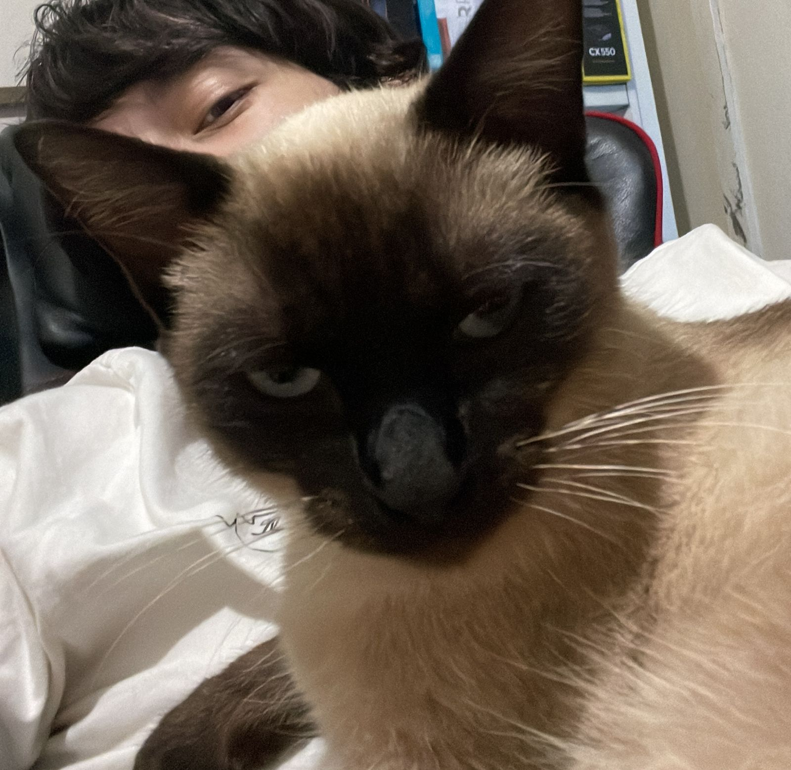

# 🧐 Who am I?

🛠️ Full Stack Dev | Debugger of the Damned | EN/PT 🇧🇷🇺🇸  
📍 Survived Legacy Wars (since 2019) | Currently: **🟢 Open for Quests**  
☕ Powered by caffeine. Monitored by a judgmental cat.  
👾 just a dev... or something else.

---

## 🔥 Bonfire

Welcome, Ashen visitor.

This is my resting place between commits — a bonfire lit by deadlines and dreams.

Here you'll find my works, scars, and stories of systems that should not have existed.

---

## 🧱 Hollow Projects

> _“What’s a sprint, if not a slow descent into madness?”_  
> — Possibly Me

| Project | Stack | Status | Summary |
|--------|-------|--------|---------|
| `legacy-crusade` | Laravel, JS | ☠️ Dead but remembered | Refactored a haunted CRM from 2013. Left with 3 sanity points. |
| `supabase-frenzy` | Supabase, Nuxt | 🔥 Ongoing | Building an MVP while Supabase occasionally screams. |
| `docker-summoner` | Docker, CI/CD | 🌀 Learning Arc | One container to rule them all (eventually). |

<!-- Adicione os projetos reais depois com badges ou links -->

---

## ⚔️ My Weapons

> _"In the age of fire, only the stack survives."_

### Frontend  


### Backend  


### Database  


### Other Tools  


---

## 🐈‍⬛ Teammate: Demon Cat

> Doesn’t code. Judges.

  

---

## ☠️ Tales from the Commit Log

```diff
+ Survived a system with 4 frameworks stitched together.
- Trusted a function named "final_fix_v2_REAL_FINAL.js"
! Accidentally deployed at 3AM. Got promoted anyway.
```

<!--
**SergioCFilho/SergioCFilho** is a ✨ _special_ ✨ repository because its `README.md` (this file) appears on your GitHub profile.

Here are some ideas to get you started:

- 🔭 I’m currently working on ...
- 🌱 I’m currently learning ...
- 👯 I’m looking to collaborate on ...
- 🤔 I’m looking for help with ...
- 💬 Ask me about ...
- 📫 How to reach me: ...
- 😄 Pronouns: ...
- ⚡ Fun fact: ...
-->
